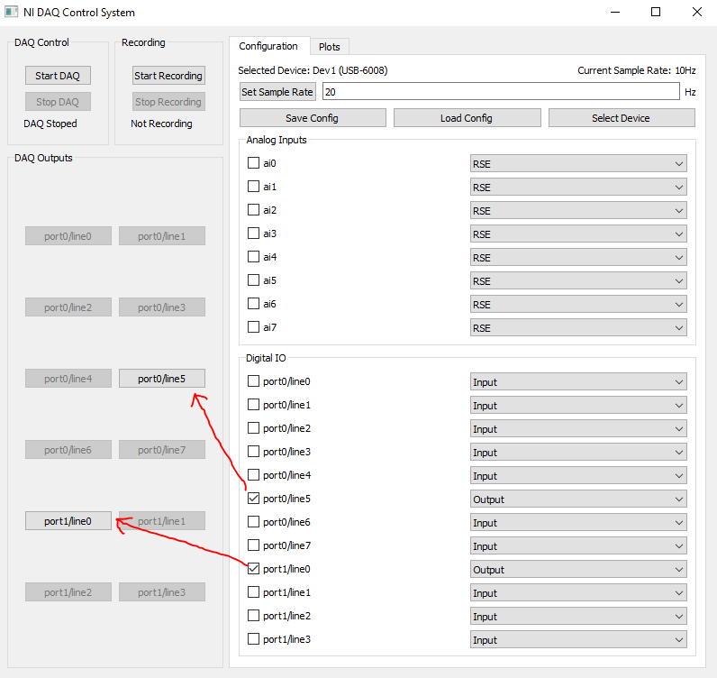

# NI-DAQ GUI Monitor

The NI-DAQ-Monitor is a Graphical User Interface (GUI) that allows you to configure NI-DAQ devices, plot readings & waveforms in real time, and actvate of digital output pins. It was created by [Nathan Hardie](https://github.com/Nate-4-4) for use in research conducted at [Aero-Propulsion, Mechatronics, and Energy](https://ame.fsu.edu).

## Repository Structure

```bash
├── dist/                       
│   └── GUI.exe                 # Distributable Windows Executable
└── GUI.py                      # Python Source Code
```

## Dependencies
- **NIDAQMX**: Library used to interface with NI-DAQ devices.
- **PyQt5**: GUI core framework.
- **PyQtGraph**: Real time plotting.

## Usage
The GUI has three main sections: *Control Section*, *Configuration Section*, and *Plotting Section*. The *Control Section* is always present on the left side of the window, while the right side can switch between the *Configuration Section* or the *Plotting Section*. 


### Configuration
The *Configuration Section* is shown by default when the application starts. Before doing anything else, a DAQ needs to be selected. The **Select Device** button can be used to choose a DAQ. A single device is chosen from the list of available DAQs. If you want to use multiple DAQs with the same computer, you can run multiple instances of the GUI. 


After selecting a device, the GUI will populate with the channels that are available for that particular device. A channel can be activated or deactivated with it's checkbox. The channel's mode can be changed with the dropdown menu. Note that not all channels will have the same modes available. Check the documentation for details specific to your device. 


The device sample rate can be set by entering a frequency in the box near the top of the *Configuration Section* and then pressing the **Set Sample Rate** button. The current sample rate is displayed at the top right of the *Configuration Section*.


After choosing a satisfactory configuration, the **Save Config** button can be used to save the configuration to a [.json](testConfig2.json) file for future usage. The **Load Config** button can be used to load a previously saved config. After choosing your config file, you will also be prompted to choose the device to configure. Only devices that match the DAQ model the config was made for will be listed. If you have any issues loading a configuration, use the **Select Device** button to start fresh and remake the configuration.


### Control
After the device has be adequetly configured, the control tab can be used to start measurements, recordings, and to activate digital output sigals. The **Start DAQ** and **Stop DAQ** buttons are used to start and stop the device. 


While the DAQ is running, recording can be started with the **Start Recording** button. This will prompt you to enter the file that the recording should be saved to. Recording can be stoped with the **Stop Recording** button, or by stopping the DAQ with the **Stop DAQ** button.


Recordings are saved in [.csv](testFile.csv) format. Each row in the table is timestamped and corrisponds to one sample of the DAQ. 


While the DAQ is running, digital output signals can be controled using buttons in the section labeled *DAQ Outputs*. The button for channels that are not configured as outputs will be grayed out. Toggling a button toggles the associated signal. Digital outputs are plotted and recorded with the input signals.



### Plotting

While the DAQ is running, the analog signals and digital waveforms that have been configured are plotted in the *Plotting Section*. The *Plotting Section* can be selected at the top of the window. There is one plot for the analog signals and one plot for the digital wavefroms. 


Plot axes automatically scale. The x-axis (time) is limited by the **Max Plot Width** option. This keeps the plots from becoming too dense after the DAQ has run for a long time. It can be changed by entering a new value in the box at the top of the *Plotting Section* and pressing the **Set Plot Width** button. The max plot width will only update if the DAQ is stoped and restarted. 


